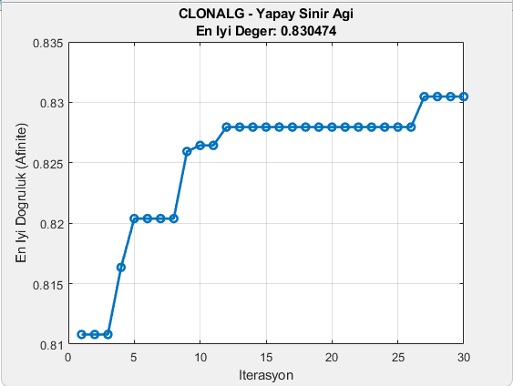
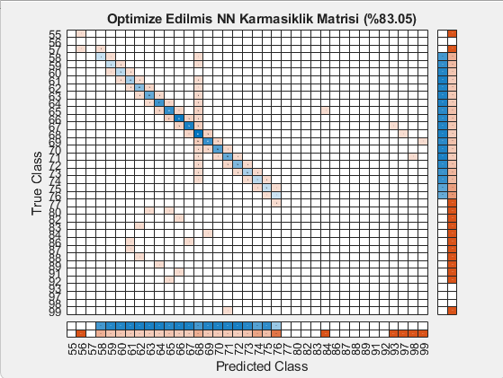

# Öğrenci Durumu Veri Setinde CLONALG ile Yapay Sinir Ağı Optimizasyonu

Bu proje, biyolojik bağışıklık sisteminin çalışma prensiplerinden ilham alan **Klonal Seçim Algoritması (CLONALG)** kullanılarak, MATLAB üzerinde geliştirilen çok katmanlı Yapay Sinir Ağlarının (Neural Network) hiperparametrelerini optimize etmeyi hedefler.

## 🚀 Projenin Amacı
Çalışmada, öğrenci durumu verileri üzerinden sınıflandırma yapılması amaçlanmıştır. Standart *Classification Learner* arayüzü ile yapılan ön testlerde en iyi sonucun **%76.8** ile "Trilayered Neural Network" modeline ait olduğu gözlemlenmiştir. 

Geleneksel hiperparametre arama yöntemleri yerine, evrimsel bir yaklaşım olan CLONALG kullanılarak bu başarının artırılması ve en uygun ağ mimarisinin dinamik olarak bulunması hedeflenmiştir.

Sinir ağının mimarisini ve öğrenme yeteneğini belirleyen **6 Kritik Hiperparametre (Gen)** optimize edilmiştir:
1. `Layer 1 Size`: İlk gizli katmandaki nöron sayısı (5-100)
2. `Layer 2 Size`: İkinci gizli katmandaki nöron sayısı (5-100)
3. `Layer 3 Size`: Üçüncü gizli katmandaki nöron sayısı (5-100)
4. `Activations`: Aktivasyon fonksiyonu (relu, tanh, sigmoid, none)
5. `Lambda`: L2 Regülarizasyon (Aşırı öğrenmeyi önleme) katsayısı
6. `Katman Sayısı`: Ağın kaç gizli katmandan oluşacağı (1, 2 veya 3)

## 🧬 Algoritma Mantığı
CLONALG algoritması şu adımları izler:
1. **Antikor Üretimi:** Rastgele ağ mimarileri ve hiperparametre setleri (Kromozom/Gen) oluşturulur.
2. **Afinite Hesaplama:** Sinir ağları bu parametrelerle eğitilir ve test seti üzerindeki doğruluk oranları (afinite) ölçülür.
3. **Klonlama:** En başarılı antikorlar (ağ mimarileri) başarı oranlarına göre orantılı olarak çoğaltılır.
4. **Hipermutasyon:** Başarısı düşük olan klonlara daha yüksek, başarılı olanlara daha düşük mutasyon uygulanarak arama uzayı taranır.
5. **Çeşitlilik Koruma (Diversity Maintenance):** Popülasyonun en kötü üyeleri atılarak yerlerine tamamen rastgele yeni ağ çözümleri eklenir.

## 📊 Eğitim Süreci ve Optimizasyon Sonuçları

CLONALG algoritması, 50 kişilik bir popülasyonla 30 iterasyon boyunca çalıştırılmış ve toplamda binlerce farklı ağ mimarisini sıfırdan eğitip test etmiştir. Eğitim süreci **3472.55 saniye (yaklaşık 58 dakika)** sürmüştür.

**İterasyon Gelişimi:**
* İlk rastgele popülasyon sonucunda (1. İterasyon) ulaşılan en yüksek doğruluk: **%81.07**
* 12. İterasyonda algoritmanın bulduğu ara çözüm (14-66-42 Nöron, Sigmoid): **%82.79**
* **27. İterasyonda** gerçekleşen hipermutasyon sonucu bulunan en iyi mimari: **%83.04**

| Model | Classification Learner Başarısı | CLONALG Optimize Başarı | Başarı Artışı |
| :--- | :---: | :---: | :---: |
| Yapay Sinir Ağı | % 76.80 | **% 83.04** | **+ % 6.24** |

### 🏆 En İyi Ağ Mimarisi (Hiperparametreler)
Algoritma, 1, 2 ve 3 katmanlı tüm kombinasyonları denedikten sonra problemi çözmek için en uygun yapının **3 Gizli Katmanlı (Trilayered)** bir ağ olduğuna karar vermiştir:
* **En İyi Katman Dizilimi (LayerSizes):** `[16 12 60]`
* **En İyi Aktivasyon Fonksiyonu:** `relu`
* **En İyi Lambda Değeri:** `0`

## 📈 Görsel Analizler

*(Not: Aşağıdaki `.fig` dosyalarının görsellerini `afinite_grafigi.png` ve `karmasiklik_matrisi.png` olarak proje dizinine eklemelisiniz.)*

### Yakınsama (Convergence) Grafiği
Bu grafik, CLONALG algoritmasının 30 iterasyon boyunca en iyi çözüme nasıl adım adım yaklaştığını göstermektedir.

### Karmaşıklık Matrisi (Confusion Matrix)
Aşağıdaki karmaşıklık matrisi, bulunan en iyi ağ mimarisinin (`[16 12 60] - relu`) test verisi üzerindeki sınıflandırma performansını detaylandırmaktadır.

## 📂 Dosya Yapısı
* `main.m`: Projenin ana giriş noktasıdır ve optimizasyon döngüsünü (CLONALG) yönetir.
* `veri_on_isleme.m`: Veri setini (`veri.mat`) yükler ve Eğitim/Test olarak böler.
* `ais_populasyon_olustur.m`: Başlangıç antikorlarını (hiperparametre dizilimlerini) üretir.
* `ais_hesapla_fitness.m`: `fitcnet` modelini eğiterek doğruluğu (afiniteyi) hesaplar.
* `ais_klonlama_ve_mutasyon.m`: En iyi modelleri seçer, orantılı klonlar ve ters orantılı mutasyona uğratır.
* `ais_secim.m`: Çeşitliliği koruyarak lokal minimumdan kaçışı sağlar ve yeni jenerasyonu belirler.