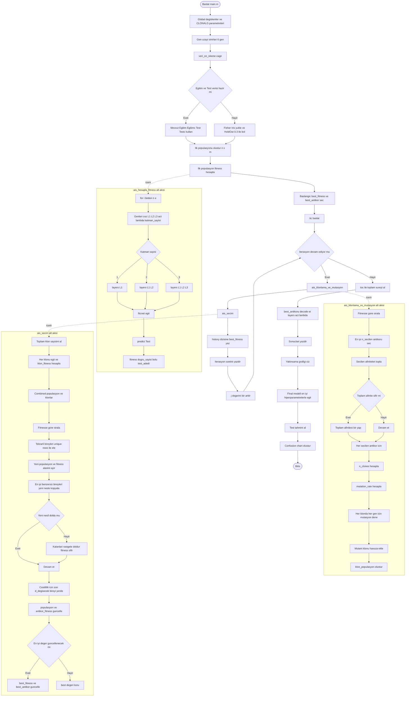

# Proje Akis Semasi

```mermaid
flowchart TD
    A([Baslat main.m]) --> B[Global degiskenler ve CLONALG parametreleri]
    B --> C[Gen uzayi sinirlari 6 gen]
    C --> D[veri_on_isleme cagir]
    D --> E{Egitim ve Test verisi hazir mi}
    E -- Evet --> F[Mevcut Egitim Egitimc Test Testc kullan]
    E -- Hayir --> G[Fisher Iris yukle ve HoldOut 0.3 ile bol]
    F --> H[Ilk populasyonu olustur n x m]
    G --> H
    H --> I[Ilk populasyon fitness hesapla]
    I --> J[Baslangic best_fitness ve best_antikor sec]
    J --> K[tic baslat]
    K --> L{Iterasyon devam ediyor mu}
    L -- Evet --> M[ais_klonlama_ve_mutasyon]
    M --> N[ais_secim]
    N --> O[history dizisine best_fitness yaz]
    O --> P[Iterasyon ozetini yazdir]
    P --> Q[j degerini bir arttir]
    Q --> L
    L -- Hayir --> R[toc ile toplam sureyi al]
    R --> S[best_antikoru decode et layers act lambda]
    S --> T[Sonuclari yazdir]
    T --> U[Yakinsama grafigi ciz]
    U --> V[Final modeli en iyi hiperparametrelerle egit]
    V --> W[Test tahmini al]
    W --> X[Confusion chart olustur]
    X --> Y([Bitis])

    subgraph F1[ais_hesapla_fitness alt akisi]
        I1[for i birden n e] --> I2[Genleri coz L1 L2 L3 act lambda katman_sayisi]
        I2 --> I3{Katman sayisi}
        I3 -- 1 --> I4[layers L1]
        I3 -- 2 --> I5[layers L1 L2]
        I3 -- 3 --> I6[layers L1 L2 L3]
        I4 --> I7[fitcnet egit]
        I5 --> I7
        I6 --> I7
        I7 --> I8[predict Test]
        I8 --> I9[fitness dogru_sayisi bolu test_adedi]
    end
    I -. icerir .-> I1

    subgraph F2[ais_klonlama_ve_mutasyon alt akisi]
        M1[Fitnesse gore sirala] --> M2[En iyi n_secilen antikoru sec]
        M2 --> M3[Secilen afiniteleri topla]
        M3 --> M4{Toplam afinite sifir mi}
        M4 -- Evet --> M5[Toplam afinitesi bir yap]
        M4 -- Hayir --> M6[Devam et]
        M5 --> M7[Her secilen antikor icin]
        M6 --> M7
        M7 --> M8[n_clones hesapla]
        M8 --> M9[mutation_rate hesapla]
        M9 --> M10[Her klonda her gen icin mutasyon dene]
        M10 --> M11[Mutant klonu havuza ekle]
        M11 --> M12[klon_populasyon olustur]
    end
    M -. icerir .-> M1

    subgraph F3[ais_secim alt akisi]
        N1[Toplam klon sayisini al] --> N2[Her klonu egit ve klon_fitness hesapla]
        N2 --> N3[Combined populasyon ve klonlar]
        N3 --> N4[Fitnesse gore sirala]
        N4 --> N5[Tekrarli bireyleri unique rows ile ele]
        N5 --> N6[Yeni populasyon ve fitness alanini ayir]
        N6 --> N7[En iyi benzersiz bireyleri yeni nesle kopyala]
        N7 --> N8{Yeni nesil doldu mu}
        N8 -- Hayir --> N9[Kalanlari rastgele doldur fitness sifir]
        N8 -- Evet --> N10[Devam et]
        N9 --> N10
        N10 --> N11[Cesitlilik icin son d_degisecek bireyi yenile]
        N11 --> N12[populasyon ve antikor_fitness guncelle]
        N12 --> N13{En iyi deger guncellenecek mi}
        N13 -- Evet --> N14[best_fitness ve best_antikor guncelle]
        N13 -- Hayir --> N15[best degeri koru]
    end
    N -. icerir .-> N1
```