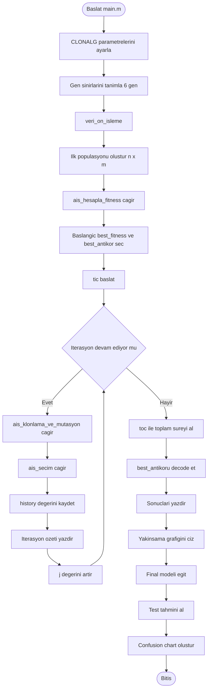
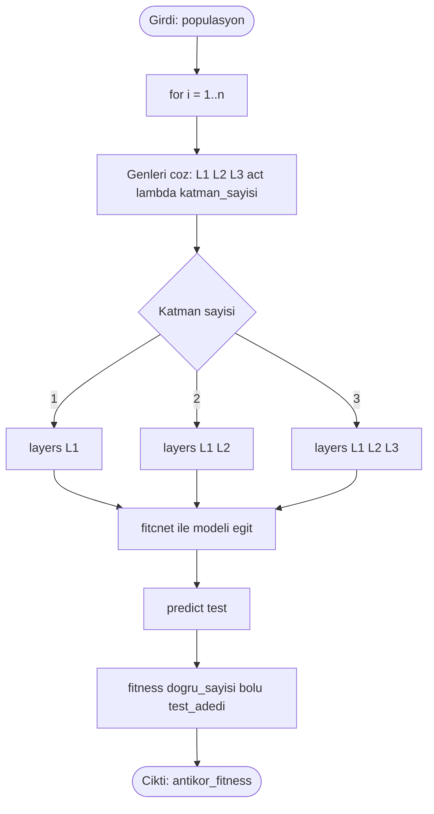
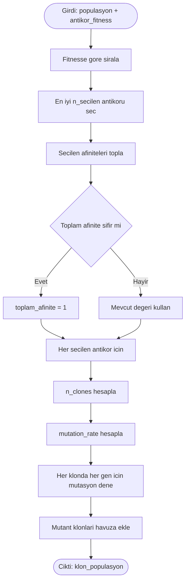
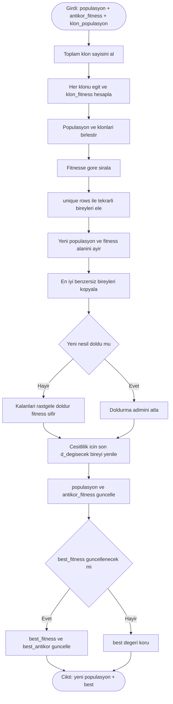

# Proje Akis Semasi

Alt akislar ayri cizildi ki gorunum karmasik olmasin ve her adimin girdisi/ciktisi net olsun.

Ana akista cagri eslestirmesi:
- ais_hesapla_fitness: Ana akis adimi F
- ais_klonlama_ve_mutasyon: Ana akis adimi J
- ais_secim: Ana akis adimi K

## 1) Ana Akis

## 2) ais_hesapla_fitness Alt Akisi

## 3) ais_klonlama_ve_mutasyon Alt Akisi

## 4) ais_secim Alt Akisi

